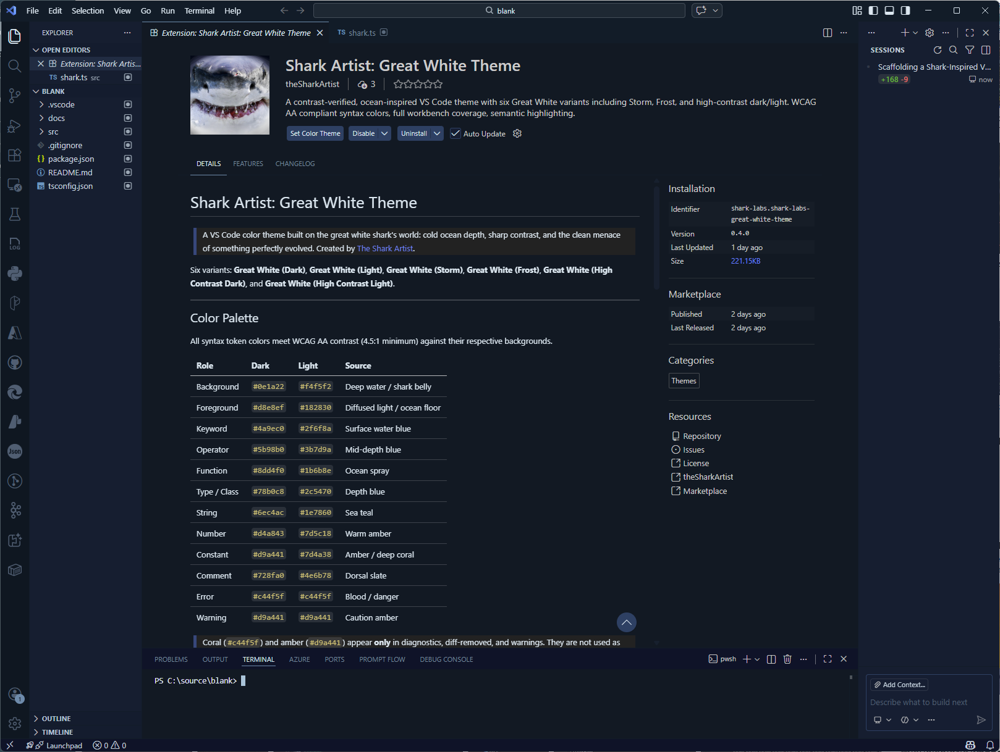
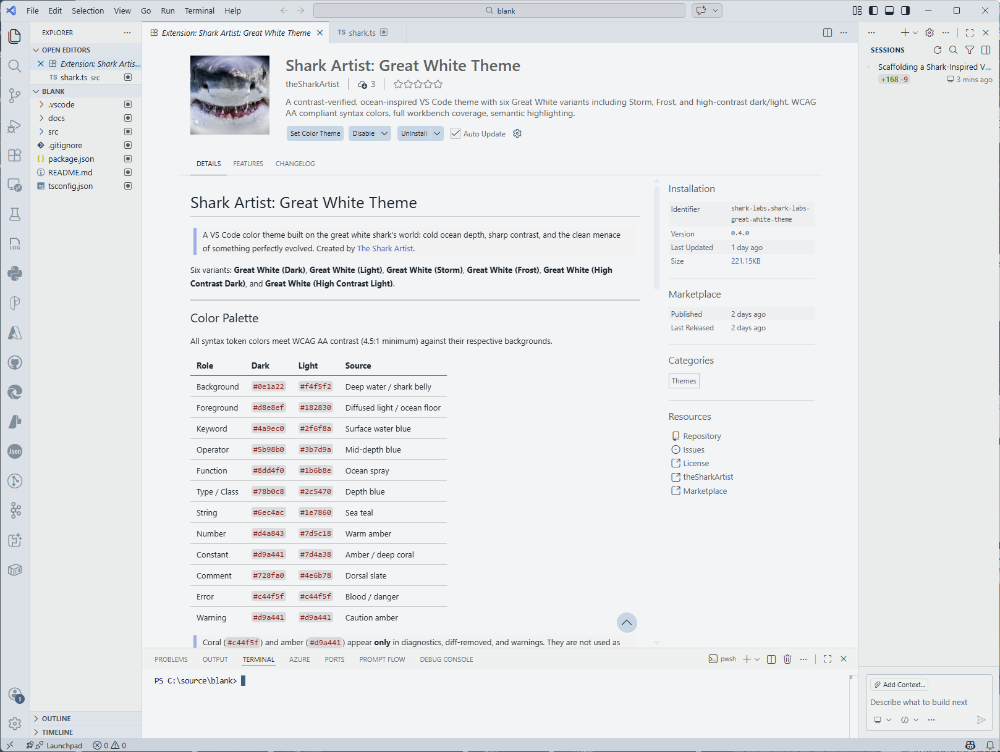
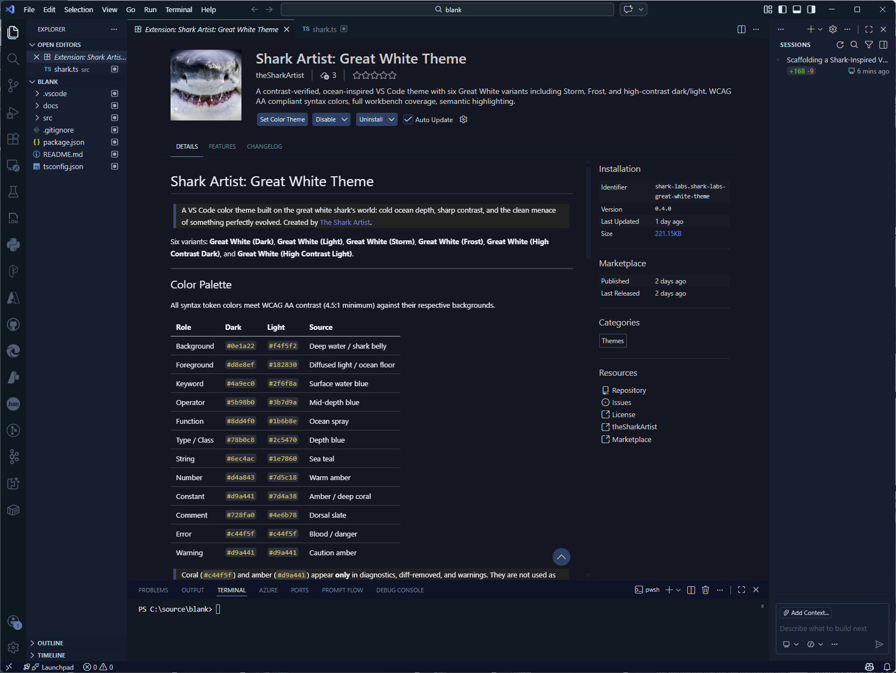
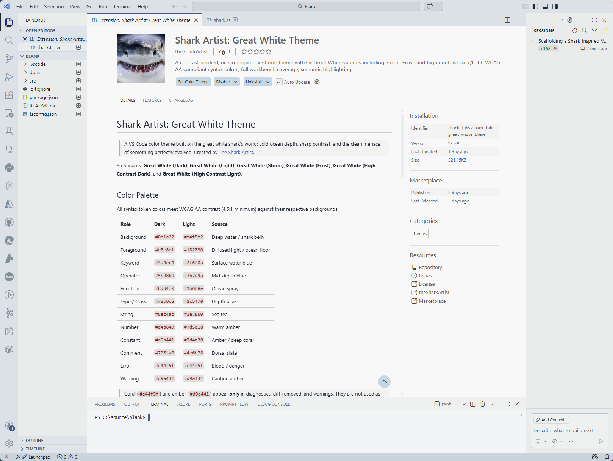
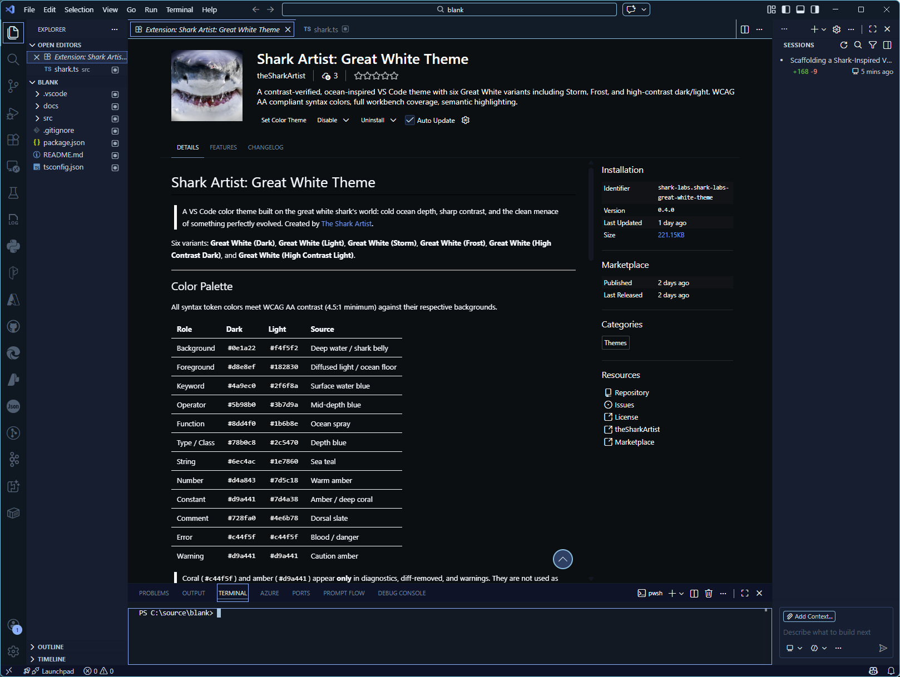
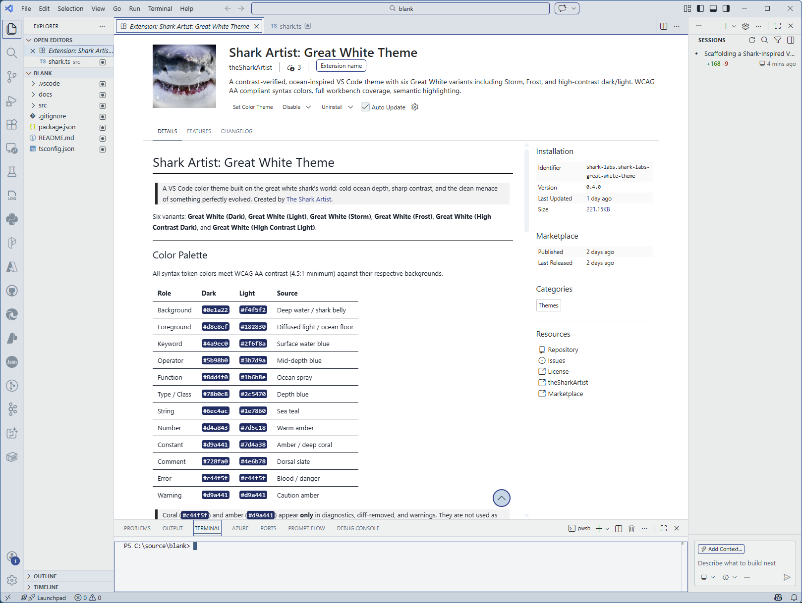

# Shark Artist: Great White Theme

> A VS Code color theme built on the great white shark's world: cold ocean depth, sharp contrast, and the clean menace of something perfectly evolved.
> Created by [The Shark Artist](https://thesharkartist.com).

Six variants: **Great White (Dark)**, **Great White (Light)**, **Great White (Storm)**, **Great White (Frost)**, **Great White (High Contrast Dark)**, and **Great White (High Contrast Light)**.

---

## Screenshots

### Great White (Dark)



### Great White (Light)



### Great White (Storm)



### Great White (Frost)



### Great White (High Contrast Dark)



### Great White (High Contrast Light)



---

## Color Palette

All syntax token colors meet WCAG AA contrast (4.5:1 minimum) against their respective backgrounds.

| Role | Dark | Light | Source |
|---|---|---|---|
| Background | `#0e1a22` | `#f4f5f2` | Deep water / shark belly |
| Foreground | `#d8e8ef` | `#182830` | Diffused light / ocean floor |
| Keyword | `#4a9ec0` | `#2f6f8a` | Surface water blue |
| Operator | `#5b98b0` | `#3b7d9a` | Mid-depth blue |
| Function | `#8dd4f0` | `#1b6b8e` | Ocean spray |
| Type / Class | `#78b0c8` | `#2c5470` | Depth blue |
| String | `#6ec4ac` | `#1e7860` | Sea teal |
| Number | `#d4a843` | `#7d5c18` | Warm amber |
| Constant | `#d9a441` | `#7d4a38` | Amber / deep coral |
| Comment | `#728fa0` | `#4e6b78` | Dorsal slate |
| Error | `#c44f5f` | `#c44f5f` | Blood / danger |
| Warning | `#d9a441` | `#d9a441` | Caution amber |

> Coral (`#c44f5f`) and amber (`#d9a441`) appear **only** in diagnostics, diff-removed, and warnings. They are not used as general syntax accents.

### Additional Great White Palettes

The new variants extend the gray-red-white-blue design space while preserving token hierarchy and readability.

| Variant | Background | Foreground | Primary Blue | Secondary Blue | Red Accent | Notes |
|---|---|---|---|---|---|---|
| Great White (Storm) | `#111820` | `#e7edf2` | `#4f7ea8` | `#6c92b3` | `#c26b73` | Deeper slate contrast, cooler surfaces, red used for readonly/constant accents |
| Great White (Frost) | `#f7f8f7` | `#1a2630` | `#2f5f84` | `#3d7298` | `#8a4d5a` | Bright neutral surface with tighter blue-gray separation |
| Great White (High Contrast Dark) | `#0b0f12` | `#f6fbff` | `#6eb8ff` | `#9cc6f3` | `#ff9aa7` | Maximum dark-mode legibility, stronger cursor/selection boundaries |
| Great White (High Contrast Light) | `#ffffff` | `#12202a` | `#0f5f93` | `#266f9f` | `#8a3848` | Maximum light-mode legibility with strong focus outlines |

## Color Theory and VS Code Best Practices

- **Use luminance for hierarchy first**: code readability improves when semantic groups differ in lightness before hue.
- **Reserve warm tones for urgency**: diagnostics keep the canonical coral/amber signal, while standard syntax remains primarily cool.
- **Separate TextMate and semantic rules**: every token-family color change is mirrored in both `tokenColors` and `semanticTokenColors`.
- **Maintain workbench/token parity**: cursor, selection, lists, tabs, and focus borders follow the same palette axis as syntax tokens.
- **Support low-vision scenarios**: the high-contrast variants increase foreground-to-background separation and UI boundary visibility.

---

## Features

- **Contrast-verified** -- all token colors computed against WCAG AA (4.5:1) before release.
- **Six variants** -- Dark and Light foundations, plus Storm, Frost, High Contrast Dark, and High Contrast Light.
- **Extended family** -- Storm and Frost provide gray-red-white-blue alternatives while keeping Great White identity.
- **High-contrast options** -- dedicated dark and light high-contrast themes for accessibility-first sessions.
- **Theme Switcher** -- a persistent `🦈` status bar button (always visible, left side) that opens a focused Quick Pick for instant switching between all Great White variants. No hunting through hundreds of themes.
- **Semantic highlighting** -- semantic token rules take priority over TextMate for TypeScript, Python, Rust, Go, and other language-server-supported files.
- **Bracket pair colorization** -- six distinct ocean-derived colors for nested brackets.
- **Full workbench coverage** -- 173 color keys: editor, sidebar, activity bar, tabs, status bar, title bar, input fields, buttons, lists, breadcrumbs, diff, peek view, minimap, git decorations, scrollbar, notifications, terminal.
- **HTML / JSX / CSS** -- tag names, attributes, and CSS properties explicitly styled.
- **Markdown** -- headings (bold), italic, inline code, fenced blocks, links, blockquotes.
- **Terminal ANSI** -- consistent 16-color ANSI palette shared across all variants.
- **Explorer file nesting** -- smart nesting patterns that group `package.json`, `tsconfig.json`, `.env`, `README.md`, `vite.config.*`, `*.ts`, C/C++ headers, Python lockfiles, CMake presets, PowerShell scripts, and systemd units under their logical parent nodes automatically.
- **Entry point + config decorations** -- the Explorer badges entry point files with `E` (amber) and config/build files with `C` (sky blue); parent folders tint amber when they contain an entry point. Individual badge types can be toggled independently.
- **Copilot Context Gauge** -- a real-data status bar gauge showing actual context window consumption from Copilot CLI sessions and Chat, scoped to the open workspace. Three severity zones (healthy/warning/critical) with trend arrows and a click-through detail panel. No popups, no automatic theme switches.
- **AI-aware colors** -- `editorGhostText`, `editor.inlineSuggest`, `inlineChat`, `inlineChatDiff`, `chat`, and `terminalCommandDecoration` color groups tuned for Copilot ghost text, the Ctrl+I inline chat panel, AI-generated diffs, and terminal command decorations.
- **Agent file icons (opt-in)** -- `Great White: Agent File Icons` icon theme provides custom SVG icons for `AGENTS.md`, `CLAUDE.md`, `GEMINI.md`, `COPILOT.md`, `plan.md`, `.learnings/`, and `.copilot/` in the ocean-blue palette.
- **Agent product icons (opt-in, foundation)** -- `Great White: Agent Product Icons` product icon theme stub; full custom icon font planned for a future release.
- **AGENTS.md syntax callouts (auto)** -- a Markdown-injected TextMate grammar highlights agent-instruction prefixes (`CRITICAL:`, `WARNING:`, `TODO:`, `NOTE:`, etc.) in semantic colors automatically in every Markdown file.
- **Self-improving** -- includes an audit script, monthly GitHub Actions loop, and four custom Copilot agents (`@theme-editor`, `@theme-auditor`, `@learnings-clerk`, `@release-manager`) that enforce theme rules during development.

---

## Install

### VS Code Marketplace

1. Open the Extensions panel (`Ctrl+Shift+X` / `Cmd+Shift+X`).
2. Search **Shark Artist: Great White Theme**.
3. Click **Install**.
4. Press `Ctrl+K Ctrl+T` / `Cmd+K Cmd+T` and select any **Great White** variant.

### From a .vsix file

```bash
code --install-extension shark-labs-great-white-theme-x.x.x.vsix
```

---

## Local Development

```bash
git clone https://github.com/johnsirmon/shark-artist-great-white-theme.git
cd shark-artist-great-white-theme
code .
# Press F5 -> Extension Development Host opens
# Run: Preferences: Color Theme -> choose any Great White variant
```

**Test across:** TypeScript, Python, JSON, Markdown, HTML/JSX -- and check the diff editor and terminal too.

### Custom Copilot Agents

Four specialist agents in `.github/agents/` assist with development:

| Agent | Purpose |
|---|---|
| `@theme-editor` | Make color/token changes correctly across all six theme variants |
| `@theme-auditor` | Audit all six variants for contrast, coverage, and symmetry |
| `@learnings-clerk` | Log mistakes and patterns to `.learnings/`, manage promotions |
| `@release-manager` | Walk the release checklist and validate packaging |

Invoke any agent with `@agent-name` in GitHub Copilot Chat.

---

## Explorer Enhancements

### File Nesting

Great White contributes smart `explorer.fileNesting.patterns` defaults so the Explorer collapses noisy sibling files under their logical parent. File nesting is **enabled by default** when the theme is active; you can disable it per workspace via the standard setting:

```jsonc
// .vscode/settings.json  — turn off nesting for this workspace
{ "explorer.fileNesting.enabled": false }
```

| Parent | Nested children |
|---|---|
| `package.json` | `yarn.lock`, `package-lock.json`, `pnpm-lock.yaml`, `.npmrc`, `.nvmrc`, `.node-version` |
| `tsconfig.json` | `tsconfig.*.json`, `jsconfig.json` |
| `*.ts` | `${capture}.test.ts`, `${capture}.spec.ts`, `${capture}.d.ts` |
| `vite.config.*` | `vite.config.*.ts`, `vitest.config.*` |
| `.env` | `.env.*`, `.env.local`, `.env.production`, `.env.development` |
| `README.md` | `CHANGELOG.md`, `CONTRIBUTING.md`, `LICENSE`, `LICENSE.txt`, `SECURITY.md`, `AGENTS.md`, `CLAUDE.md`, `GEMINI.md`, `KNOWN-ISSUES.md` |
| `*.cc` | `${capture}.hh` |
| `*.c` | `${capture}.h` |
| `CMakeLists.txt` | `CMakePresets.json`, `CMakeUserPresets.json` |
| `requirements.txt` | `requirements-dev.txt`, `requirements-test.txt`, `Pipfile`, `Pipfile.lock`, `pyproject.toml` |
| `setup.ps1` | `validate.ps1`, `verify.ps1`, `requirements.txt`, `.gitmessage` |
| `control` _(Debian)_ | `compat`, `conffiles`, `lintian-overrides` |
| `postinst` _(Debian)_ | `postrm`, `preinst`, `prerm` |
| `*.service` _(systemd)_ | `*.timer` |

### Entry Point & Config Decorations

The extension registers a `FileDecorationProvider` that visually highlights important files in the Explorer:

| Badge | Color | Meaning | `propagate` |
|---|---|---|---|
| `E` | Amber `#FFB347` (dark) / `#CC7700` (light) | Entry point — resolved from `package.json` `main`/`module`/`exports`/`bin` fields, or a well-known filename within 2 directory levels of the root: `index.ts/js`, `main.ts/py/__main__.py`, `app.ts`, `server.ts`, `cli.ts`, `main.c/cc/cpp`, `setup.ps1`, `activate.ps1`, `install.sh`, `start.sh`, `entrypoint.sh` | ✅ parent folders also tint |
| `C` | Sky blue `#87CEEB` (dark) / `#2980B9` (light) | Config / build file — matches `*.config.ts/js/mjs`, `*.rc.js`, `.eslintrc*`, `jest.config*`, `vitest.config*`, `next.config*`, `vite.config*`, `CMakeLists.txt`, `Makefile`, `GNUmakefile`, `vcpkg.json`, `requirements.txt`, `*.props`, `*.cmake`, `Directory.*.props`, `*.ini`, `*.conf`, `*.service`, `*.timer` | ❌ folders stay undecorated |

The `E` badge uses `propagate: true`, so the folder containing an entry point also receives the amber tint — making the path to an entry point visible at a glance even when folders are collapsed.

Entry points are resolved by reading the workspace's `package.json` once per folder (cached). The cache is invalidated automatically whenever `package.json` changes on disk.

**Settings** — three knobs are available:

| Setting | Default | Description |
|---|---|---|
| `greatWhite.showEntryPointDecorations` | `true` | Master toggle — hides all badges immediately when disabled |
| `greatWhite.showEntryPointBadges` | `true` | Show/hide the `E` badge independently (master must be on) |
| `greatWhite.showConfigFileBadges` | `true` | Show/hide the `C` badge independently (master must be on) |

```jsonc
// User or workspace settings — hide only config badges
{
  "greatWhite.showConfigFileBadges": false
}
```

All three settings take effect immediately with no reload required.

### Commands

All commands are available via the Command Palette (`Ctrl+Shift+P` / `Cmd+Shift+P`). Search **Great White**.

| Command | Description |
|---|---|
| `Great White: Switch Theme` | Opens a focused Quick Pick listing all Great White variants for instant switching |
| `Great White: Show Context Gauge Details` | Opens the Context Gauge detail panel showing CLI sessions, context %, trend, and chat usage |
| `Great White: Reset Explorer Decorations to Defaults` | Clears all three `greatWhite.show*` settings back to their defaults |
| `Great White: Reset File Nesting Patterns to Defaults` | Removes workspace-level `explorer.fileNesting.*` overrides, restoring contributed defaults |

---

## Theme Switcher

Starting in `v0.8.0`, a persistent status bar button lets you switch between Great White variants instantly — no `Ctrl+K Ctrl+T` required, no scrolling through every installed theme.

### Status bar button

The button lives on the **left side of the status bar** and is always visible regardless of which theme is active:

| Button | Meaning |
|---|---|
| `🌊 Dark` | Great White (Dark) is active |
| `🌩️ Storm` | Great White (Storm) is active |
| `❄️ Frost` | Great White (Frost) is active |
| `☀️ Light` | Great White (Light) is active |
| `🌑 HC Dark` | Great White (High Contrast Dark) is active |
| `🌕 HC Light` | Great White (High Contrast Light) is active |
| `🩸 Bloodloss` | Great White (Bloodloss) is active |
| `🦈 Theme` | A non-Great-White theme is active — click to switch into the family |

The label updates automatically whenever the active theme changes, including when the Context Gauge auto-applies Bloodloss.

### Switching variants

Click the button (or run `Great White: Switch Theme` from the Command Palette) to open the switcher:

- All 7 variants are listed with the currently active one pre-selected and marked `$(check) active`
- Select any variant to apply it instantly — no confirmation, no reload
- **Bloodloss** is included with a note that it is the overflow/alarm theme
- **Browse all VS Code themes…** at the bottom opens VS Code's built-in full theme picker

---

## Copilot Context Gauge

Starting in `v0.7.0`, Great White ships a passive, always-visible status bar gauge that shows actual Copilot context window consumption — sourced directly from CLI session files and Chat. There are **no popups and no automatic theme switches**.

### Status bar

The gauge sits at the bottom right and updates every 10 seconds (configurable):

| Status bar | Meaning |
|---|---|
| `🦈 CLI 38% → │ 💬 Chat —` | CLI context at 38%, stable; no chat session data |
| `🦈 CLI 58% ↑ │ 💬 Chat —` _(amber background)_ | CLI context at 58% and rising — warning zone |
| `🩸 CLI 82% ↑ │ 💬 Chat —` _(red background)_ | CLI context critical (≥ 75%) |

Trend arrows reflect the direction of change between polls: `↑` rising · `↓` falling · `→` steady.

### Severity zones

| Range | Zone | Status bar style |
|---|---|---|
| 0–49% | Healthy | Default background, `🦈` icon |
| 50–74% | Warning | Amber background, `🦈` icon |
| 75–100% | Critical | Red background, `🩸` icon |

### Click for details

Click the status bar item to open the **Context Gauge detail panel** — a QuickPick listing:

- Each CLI session scoped to the current workspace: name, model, context %, turn count, duration, output tokens, git branch
- Active sessions marked `●`, idle sessions `○`
- Copilot Chat context status (best-effort estimation, `—` when unavailable)
- Quick actions: **Refresh**, **Context Gauge Settings**

### Data sources

The gauge reads from `~/.copilot/session-state/`:

| File | Used for |
|---|---|
| `workspace.yaml` | Session name, working directory (workspace scoping), timestamps |
| `events.jsonl` | Model name, output token counts, turn counts, input message sizes |
| `inuse.*.lock` | Active/idle detection via PID lock files |

Context % is calculated as `outputTokens ÷ contextWindowSize` where the window size is looked up by model family (Claude: 200 K · GPT-5: 200 K · GPT-4: 128 K). Only sessions whose working directory matches the open workspace are shown.

### Configuration

Two settings are available:

| Setting | Default | Description |
|---|---|---|
| `greatWhite.contextGauge.enabled` | `true` | Show/hide the gauge in the status bar |
| `greatWhite.contextGauge.pollInterval` | `10` | Seconds between session file re-scans (min 3, max 120) |

```jsonc
// Example: poll every 30 seconds and reduce I/O
{
  "greatWhite.contextGauge.pollInterval": 30
}
```

### Bloodloss theme

`Great White (Bloodloss)` remains available as a **manual theme choice** in the theme picker — only the automatic switching is removed. Select it yourself for any reason; the gauge will continue to display context data regardless of which theme is active.

---

## Agentic Workflow Visibility

Starting in `v0.5.0`, Great White extends its palette into AI/agent surfaces so Copilot interactions feel native to the theme rather than using VS Code defaults.

### AI surface colors (all six variants)

| Area | Color behavior |
|---|---|
| `editorGhostText.*` | Copilot inline ghost text renders in muted teal (`#4daaaa90` dark / `#3b8a8090` light) — distinctly different from active syntax |
| `editor.inlineSuggest.*` | Background, highlight, and selection states for inline suggestions are on-palette |
| `inlineChat.*` | The Ctrl+I edit panel background, border, focus ring, shadow, region highlight, and selected state are ocean-blue across all variants |
| `inlineChatDiff.*` / `inlineChatDiffLine.*` | AI-generated diff insertions use teal; removals use coral — matching the standard diff editor |
| `chat.*` | Chat panel request background, borders, slash command styling, and avatar colors |
| `terminalCommandDecoration.*` | Terminal prompt success/error/default decorations use the ocean palette |

### Agent File Icons (opt-in)

Activate via **Preferences: File Icon Theme → Great White: Agent File Icons**.

Custom SVG icons for agent-workflow files, all in the ocean-blue/teal/amber palette:

| File / folder | Icon |
|---|---|
| `AGENTS.md` | Shark-fin agent icon |
| `CLAUDE.md` | Agent variant |
| `GEMINI.md` | Agent variant |
| `COPILOT.md` | Agent variant |
| `plan.md` | Planning icon |
| `.learnings/` | Knowledge folder |
| `.copilot/` | Copilot folder |

> VS Code only allows one active file icon theme. Selecting **Great White: Agent File Icons** replaces any previously active icon theme.

### Agent Product Icons (opt-in, foundation)

Activate via **Preferences: Product Icon Theme → Great White: Agent Product Icons**.

Currently a minimal stub using the built-in Codicon font. A full custom shark-ocean icon font is planned for a future release.

### AGENTS.md Syntax Callouts (automatic)

A TextMate grammar (`text.agents.markdown`) is injected into all Markdown files automatically. It highlights agent-instruction prefixes in semantic colors wherever they appear:

| Prefix | Color |
|---|---|
| `CRITICAL:` / `IMPORTANT:` / `NEVER:` | Error red |
| `WARNING:` / `CAUTION:` | Amber |
| `NOTE:` / `TIP:` | Comment blue |
| `TODO:` / `FIXME:` | Constant color |

Section headings, inline code, and file paths within these callouts also receive distinct styling.

---

## Design Philosophy

**1. Contrast from depth, not color count.**
The palette is narrow on purpose. Visual hierarchy comes from luminance contrast between token types, not from using many distinct hues. Every color in the palette earns its place.

**2. Danger is the only warmth.**
Coral and amber are reserved exclusively for errors, warnings, and diff-removed highlights. When you see warm color in the editor, something needs your attention. Strings, functions, and types stay cool.

**3. Dark is the ocean floor; Light is shark belly.**
The dark background evokes pressure and depth -- light barely reaches here, so every lit token stands out sharply. The light background is the pale, smooth underside: cold, clean, and high-contrast in a different direction. All variants stay on the same shark-ocean accent axis so switching feels like surfacing, not abandoning the visual language.

---

## Packaging and Publishing

```bash
npm install -g @vscode/vsce
vsce package          # creates .vsix, also runs in CI on every push to main
vsce login shark-labs
vsce publish
```

Before publishing, work through `docs/release-checklist.md`.

---

## Feedback and Issues

Found a token that looks wrong in your language?
[Open an issue](https://github.com/johnsirmon/shark-artist-great-white-theme/issues) with:
- The language and file type
- The token type that looks wrong (e.g., "parameter color is same as foreground in Rust")
- A short code snippet that reproduces it

---

## License

MIT. See [LICENSE](LICENSE).
